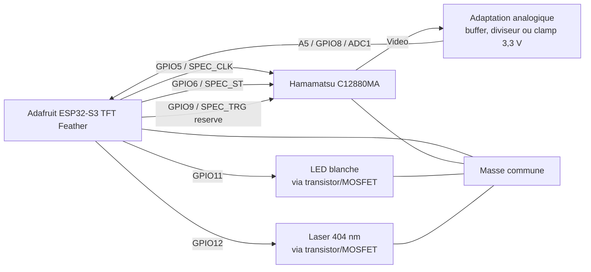

# Schema de cablage

Ce schema correspond a la premiere version ESP32-S3 du code. Il privilegie une entree analogique sur `A5/GPIO8`, qui appartient a `ADC1` sur l'Adafruit ESP32-S3 TFT Feather.

## Vue logique



## Connexions

| C12880MA / module | ESP32-S3 Feather | Notes |
| --- | --- | --- |
| `CLK` | `GPIO5` | Sortie numerique ESP32-S3 vers spectrometre |
| `ST` | `GPIO6` | Sortie numerique ESP32-S3 vers spectrometre |
| `TRG` | `GPIO9` | Reserve pour version suivante |
| `Video` | `A5` / `GPIO8` | Passer par une adaptation analogique 3,3 V max |
| `Vdd` | Alimentation adaptee au module | Souvent 5 V selon carte/module |
| `GND` | `GND` | Masse commune obligatoire |

## Commande des sources lumineuses

Ne pas alimenter directement une LED de puissance ou un laser depuis une broche GPIO.

Utiliser une commande par transistor ou MOSFET :

| Source | GPIO | Montage recommande |
| --- | --- | --- |
| LED blanche | `GPIO11` | MOSFET canal N cote masse, resistance/adaptation de courant |
| Laser 404 nm | `GPIO12` | Driver laser ou MOSFET avec limitation de courant |

## Protection de l'entree ADC

`A5/GPIO8` accepte uniquement une tension compatible ESP32-S3, donc 3,3 V maximum. Pour la sortie video du C12880MA, prevoir une adaptation :

```text
C12880MA Video -> adaptation analogique -> A5/GPIO8 ESP32-S3
```

Un simple diviseur peut suffire pour des essais prudents, mais un buffer adapte donnera une mesure plus stable et une impedance plus propre pour l'ADC.

## Rappel des broches du sketch

```cpp
constexpr uint8_t SPEC_TRG   = 9;
constexpr uint8_t SPEC_ST    = 6;
constexpr uint8_t SPEC_CLK   = 5;
constexpr uint8_t SPEC_VIDEO = A5;
constexpr uint8_t WHITE_LED  = 11;
constexpr uint8_t LASER_404  = 12;
```
